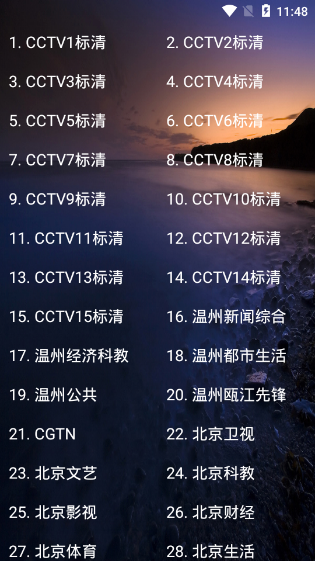
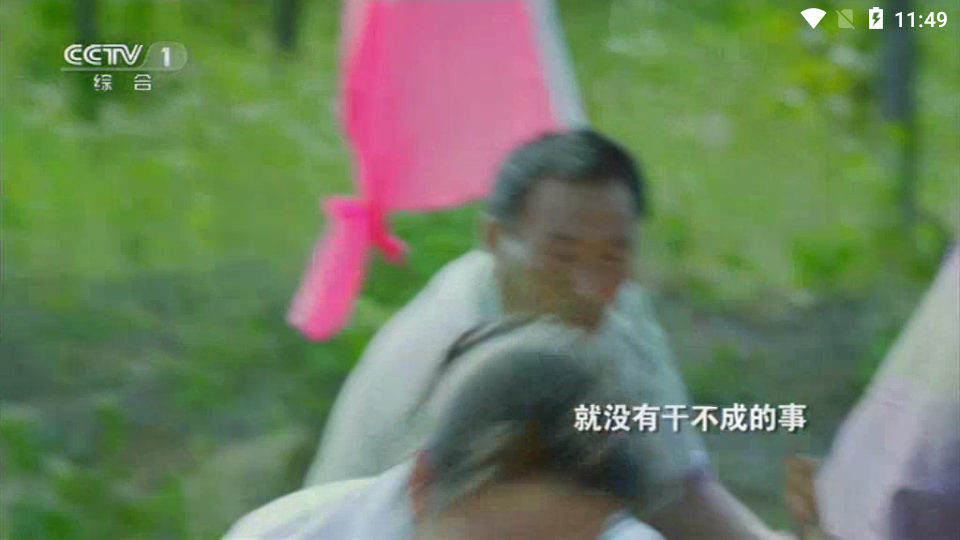

### Android TV直播电视节目

接入了自己的evideoview。

[evideoview](https://github.com/ccx1/EView)

代码实现思路:

- 1、通过RecycleView为对应的节目item,遥控器按键,可触发跳到对应的直播节目
- 2、使用ijkplay进行播放直播源
- 3、我家里使用的是英菲克机顶盒，出现了很多问题，目前都完美解决

代码实现：

- 主页面：Recycleview对应adapater
- 直播节目源。我找了很久
- 播放器，用自己播放器
- 播放页细节处理，我增加了toast的处理方式

[参考demo,鸣谢](https://github.com/hejunlin2013/LivePlayback)

### 注: 以上是原作者写的, 并且上面那个链接是第一个原作者的作品, 非常不错, 建议用上面那个链接...
 我fork后做了一点修改, 也打了个apk包...
## Demo
<a href="https://github.com/actor20170211030627/LiveplayPack/raw/master/liveplayback-debug.apk">download apk</a>

</img>

## Screenshot
</img>

</img>
